<h2>Tensorflow-Image-Segmentation-Nerve (2024/12/09)</h2>

This is the second experiment of Image Segmentation for Nerve 
 based on 
the latest <a href="https://github.com/sarah-antillia/Tensorflow-Image-Segmentation-API">Tensorflow-Image-Segmentation-API</a>, 
and  <a href="https://drive.google.com/file/d/1e3S6yhC_sWqk6Gf4_0fL7CI4gkepI497/view?usp=sharing">
Nerve-ImageMask-Dataset.zip</a>, which was derived by us from 
<a href="https://www.kaggle.com/competitions/ultrasound-nerve-segmentation/data">
<b>
 Ultrasound Nerve Segmentation: Identify nerve structures in ultrasound images of the neck
</b>
</a>
  
Please see also our first experiment <a href="https://github.com/atlan-antillia/Image-Segmentation-Nerve">Image-Segmentation-Nerve</a>
 

<b>Actual Image Segmentation for Images of 512x512 pixels</b> 
As shown below, the inferred masks look similar to the ground truth masks.  

<table>
<tr>
<th>Input: image</th>
<th>Mask (ground_truth)</th>
<th>Prediction: inferred_mask</th>
</tr>
<tr>
<td>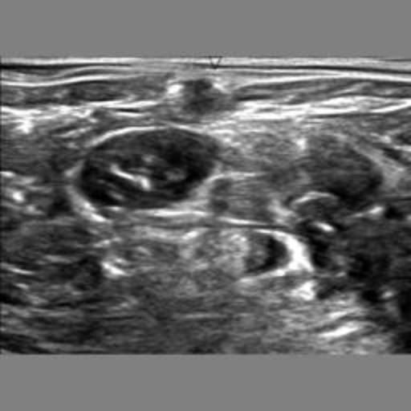</td>
<td>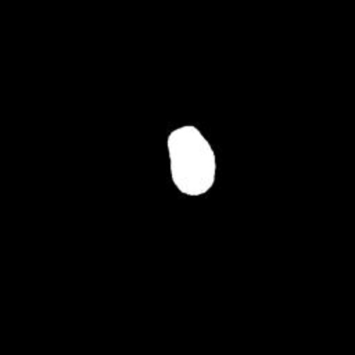</td>
<td>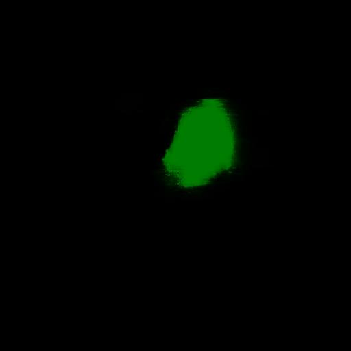</td>
</tr>

<tr>
<td>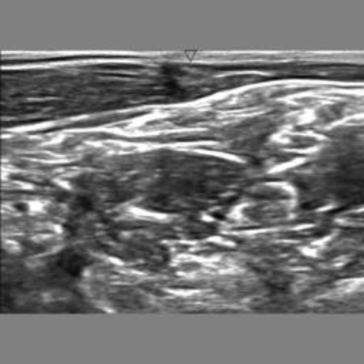</td>
<td>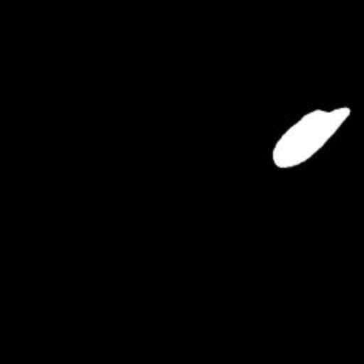</td>
<td>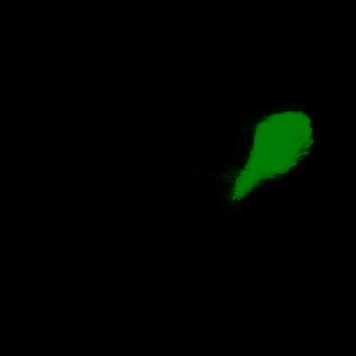</td>
</tr>

<tr>
<td>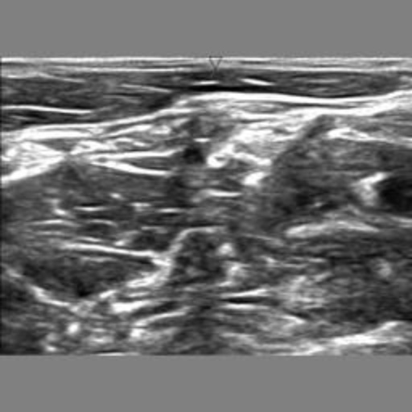</td>
<td>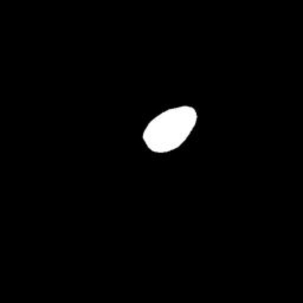</td>
<td>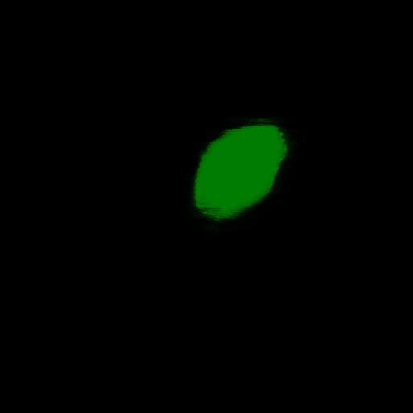</td>
</tr>
</table>

 
In this experiment, we used the simple UNet Model 
<a href="./src/TensorflowUNet.py">TensorflowSlightlyFlexibleUNet</a> for this NerveSegmentation Model. 
As shown in <a href="https://github.com/sarah-antillia/Tensorflow-Image-Segmentation-API">Tensorflow-Image-Segmentation-API</a>.
you may try other Tensorflow UNet Models: 

<li><a href="./src/TensorflowSwinUNet.py">TensorflowSwinUNet.py</a></li>
<li><a href="./src/TensorflowMultiResUNet.py">TensorflowMultiResUNet.py</a></li>
<li><a href="./src/TensorflowAttentionUNet.py">TensorflowAttentionUNet.py</a></li>
<li><a href="./src/TensorflowEfficientUNet.py">TensorflowEfficientUNet.py</a></li>
<li><a href="./src/TensorflowUNet3Plus.py">TensorflowUNet3Plus.py</a></li>
<li><a href="./src/TensorflowDeepLabV3Plus.py">TensorflowDeepLabV3Plus.py</a></li>

 

<h3>1. Dataset Citation</h3>
The dataset used here has been take from the following web site 

<a href="https://www.kaggle.com/competitions/ultrasound-nerve-segmentation/data">
<b>
 Ultrasound Nerve Segmentation: Identify nerve structures in ultrasound images of the neck 
</b>
</a>

 
<b>Dataset Description</b> 
The task in this competition is to segment a collection of nerves called the Brachial Plexus (BP) in ultrasound images. 
You are provided with a large training set of images where the nerve has been manually annotated by humans. 
Annotators were trained by experts and instructed to annotate images where they felt confident about the existence of 
the BP landmark.
 
<b>Please note these important points:</b> 

The dataset contains images where the BP is not present. Your algorithm should predict no pixel values in these cases.
As with all human-labeled data, you should expect to find noise, artifacts, and potential mistakes in the ground truth. 
Any individual mistakes (not affecting the broader integrity of the competition) will be left as is.
Due to the way the acquisition machine generates image frames, you may find identical images or very similar images.
In order to reduce the submission file sizes, this competition uses run-length encoding (RLE) on the pixel values. 
The details of how to use RLE are described on the 'Evaluation' page.
File descriptions
/train/ contains the training set images, named according to subject_imageNum.tif. Every image with the same subject 
number comes from the same person. This folder also includes binary mask images showing the BP segmentations.
/test/ contains the test set images, named according to imageNum.tif. You must predict the BP segmentation for these 
images and are not provided a subject number. There is no overlap between the subjects in the training and test sets.
train_masks.csv gives the training image masks in run-length encoded format. This is provided as a convenience to 
demonstrate how to turn image masks into encoded text values for submission.
sample_submission.csv shows the correct submission file format.

 

 
<h3>
<a id="2">
2 Nerve ImageMask Dataset
</a>
</h3>
 If you would like to train this Nerve Segmentation model by yourself,
 please download the dataset from the google drive  
<a href="https://drive.google.com/file/d/1e3S6yhC_sWqk6Gf4_0fL7CI4gkepI497/view?usp=sharing">
Nerve-ImageMask-Dataset.zip</a>
, expand the downloaded ImageMaskDataset and put it under <b>./dataset</b> folder to be
<pre>
./dataset
└─Nerve
    ├─test
    │   ├─images
    │   └─masks
    ├─train
    │   ├─images
    │   └─masks
    └─valid
        ├─images
        └─masks
</pre>
 
 
<b>Nerve Statistics</b> 
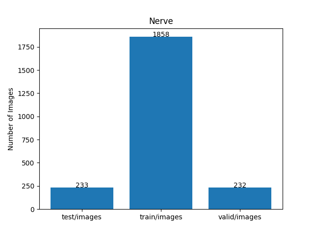 
 
As shown above, the number of images of train and valid datasets is enough to use for a training set of our segmentation model.

 
 
<b>Train_images_sample</b> 
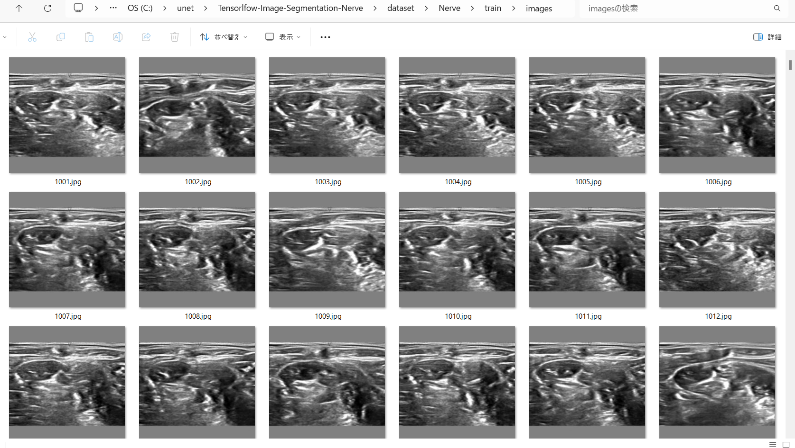
 
<b>Train_masks_sample</b> 
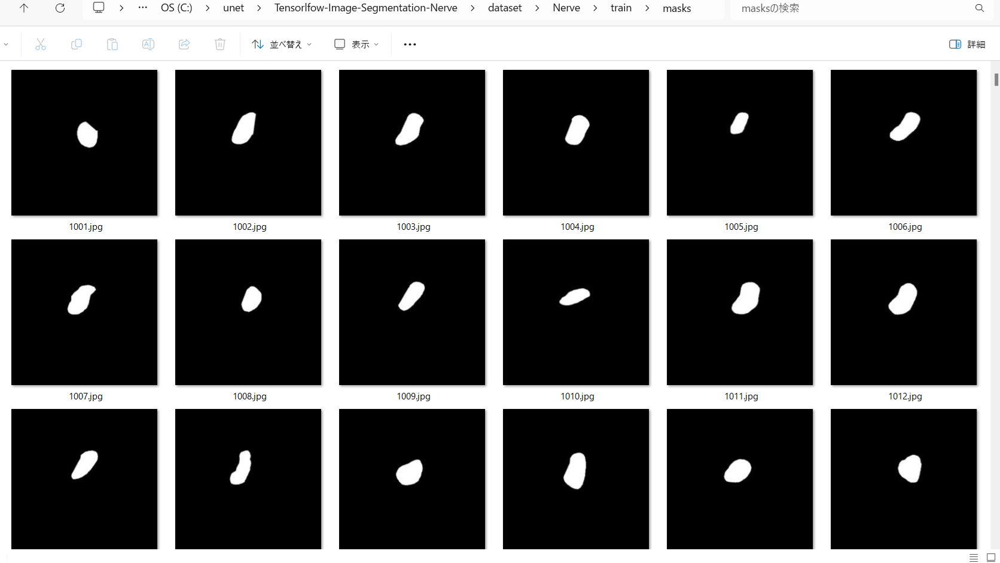
 

<h3>
3 Train TensorflowUNet Model
</h3>
 We have trained NerveTensorflowUNet Model by using the following
<a href="./projects/TensorflowSlightlyFlexibleUNet/Nerve/train_eval_infer.config"> <b>train_eval_infer.config</b></a> file.  
Please move to ./projects/TensorflowSlightlyFlexibleUNet/Nerveand run the following bat file. 
<pre>
>1.train.bat
</pre>
, which simply runs the following command. 
<pre>
>python ../../../src/TensorflowUNetTrainer.py ./train_eval_infer.config
</pre>

<b>Model parameters</b> 
Defined a small <b>base_filters</b> and large <b>base_kernels</b> for the first Conv Layer of Encoder Block of 
<a href="./src/TensorflowUNet.py">TensorflowUNet.py</a> 
and a large num_layers (including a bridge between Encoder and Decoder Blocks).
<pre>
[model]
base_filters   = 16
base_kernels   = (9,9)
num_layers     = 8
dilation       = (3,3)
</pre>

<b>Learning rate</b> 
Defined a small learning rate.  
<pre>
[model]
learning_rate  = 0.00007
</pre>

<b>Online augmentation</b> 
Disabled our online augmentation tool. 
<pre>
[model]
model         = "TensorflowUNet"
generator     = False
</pre>

<b>Loss and metrics functions</b> 
Specified "bce_dice_loss" and "dice_coef". 
<pre>
[model]
loss           = "bce_dice_loss"
metrics        = ["dice_coef"]
</pre>
<b >Learning rate reducer callback</b> 
Enabled learing_rate_reducer callback, and a small reducer_patience.
<pre> 
[train]
learning_rate_reducer = True
reducer_factor     = 0.4
reducer_patience   = 4
</pre>

<b>Early stopping callback</b> 
Enabled early stopping callback with patience parameter.
<pre>
[train]
patience      = 10
</pre>

<b>Epoch change inference callbacks</b> 
Enabled epoch_change_infer callback. 
<pre>
[train]
epoch_change_infer       = True
epoch_change_infer_dir   =  "./epoch_change_infer"
epoch_changeinfer        = False
epoch_changeinfer_dir    = "./epoch_changeinfer"
num_infer_images         = 6
</pre>

By using this callback, on every epoch_change, the inference procedure can be called
 for 6 images in <b>mini_test</b> folder. This will help you confirm how the predicted mask changes 
 at each epoch during your training process.    

<b>Epoch_change_inference output</b> 
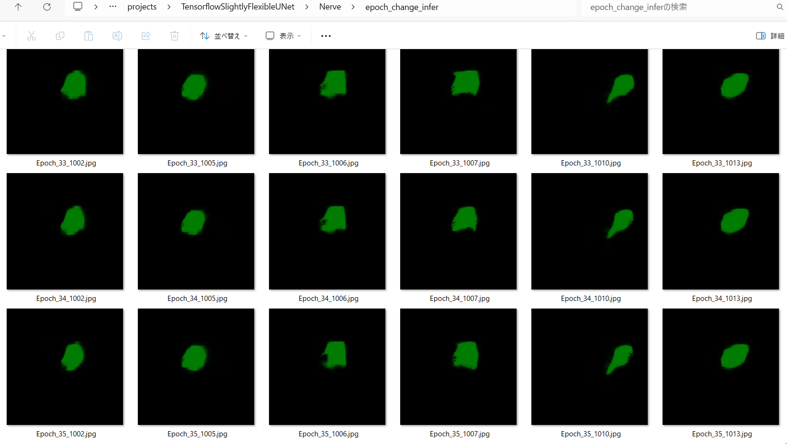 
 

In this experiment, the training process was stopped at epoch 44  by EarlyStopping Callback.  
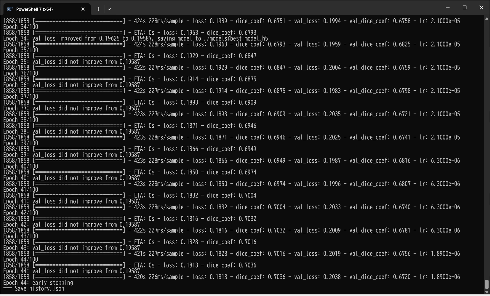 
 

<a href="./projects/TensorflowSlightlyFlexibleUNet/Nerve/eval/train_metrics.csv">train_metrics.csv</a> 
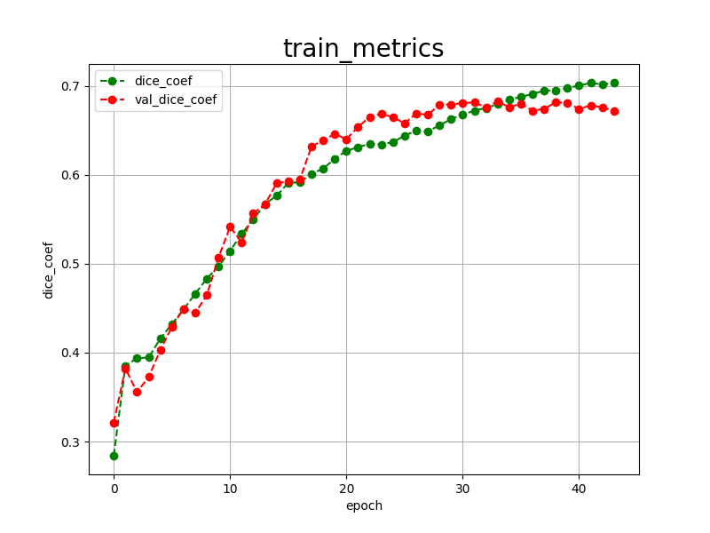 

 
<a href="./projects/TensorflowSlightlyFlexibleUNet/Nerve/eval/train_losses.csv">train_losses.csv</a> 
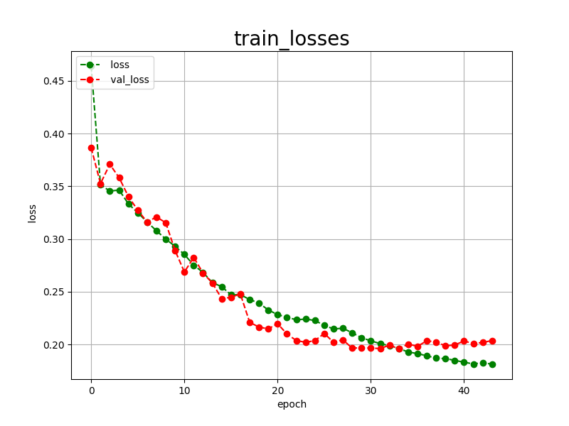 

 

<h3>
4 Evaluation
</h3>
Please move to a <b>./projects/TensorflowSlightlyFlexibleUNet/Nerve</b> folder, 
and run the following bat file to evaluate TensorflowUNet model for Nerve. 
<pre>
./2.evaluate.bat
</pre>
This bat file simply runs the following command.
<pre>
python ../../../src/TensorflowUNetEvaluator.py ./train_eval_infer_aug.config
</pre>

Evaluation console output: 
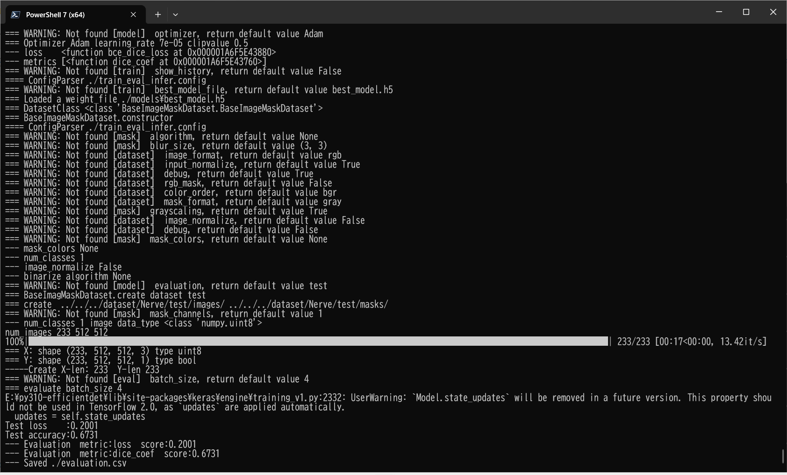
  Image-Segmentation-Nerve

<a href="./projects/TensorflowSlightlyFlexibleUNet/Nerve/evaluation.csv">evaluation.csv</a> 

The loss (bce_dice_loss) to this Nerve/test was not low, but dice_coef not so high as shown below.
 
<pre>
loss,0.2001
dice_coef,0.6731
</pre>
 

<h3>
5 Inference
</h3>
Please move to a <b>./projects/TensorflowSlightlyFlexibleUNet/Nerve</b> folder 
,and run the following bat file to infer segmentation regions for images by the Trained-TensorflowUNet model for Nerve. 
<pre>
./3.infer.bat
</pre>
This simply runs the following command.
<pre>
python ../../../src/TensorflowUNetInferencer.py ./train_eval_infer_aug.config
</pre>

<b>mini_test_images</b> 
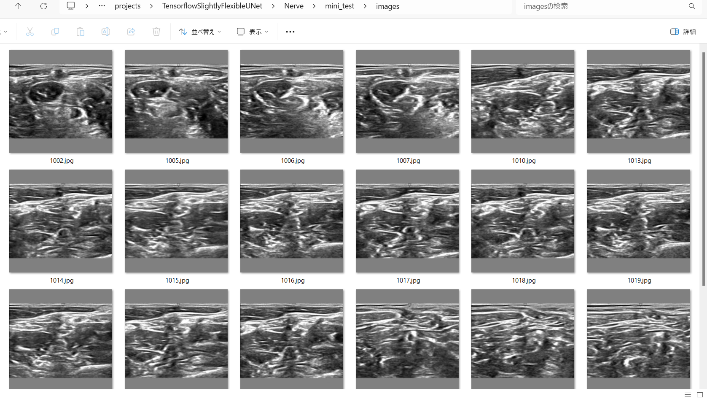 
<b>mini_test_mask(ground_truth)</b> 
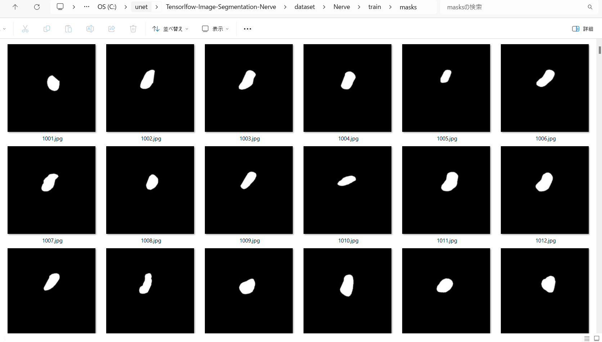 

<b>Inferred test masks</b> 
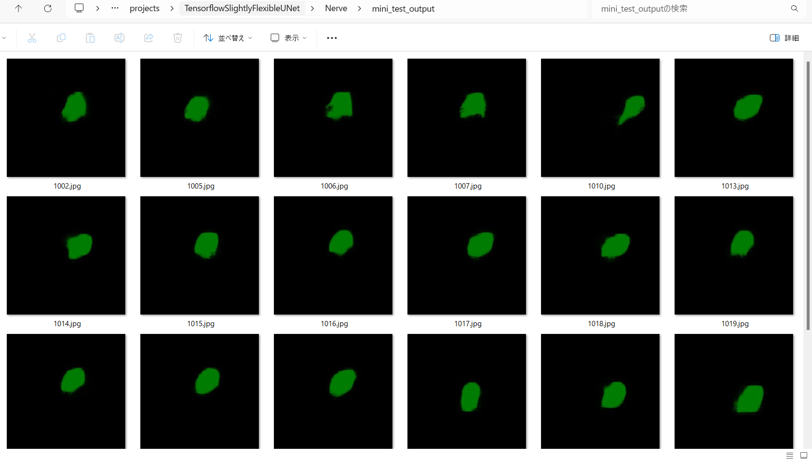 
 

<b>Enlarged images and masks </b> 

<table>
<tr>
<th>Image</th>
<th>Mask (ground_truth)</th>
<th>Inferred-mask</th>
</tr>

<tr>
<td></td>
<td></td>
<td></td>
</tr>

<tr>
<td>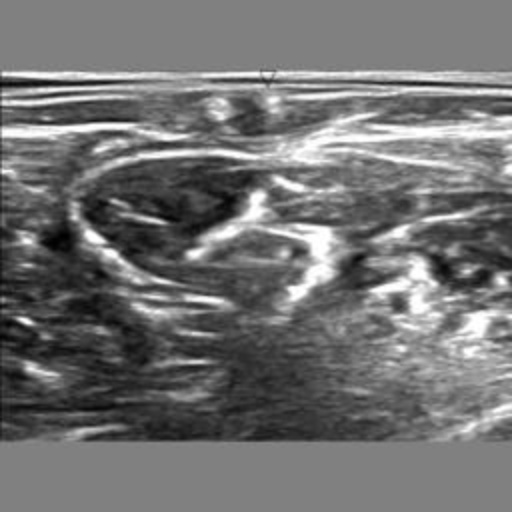</td>
<td>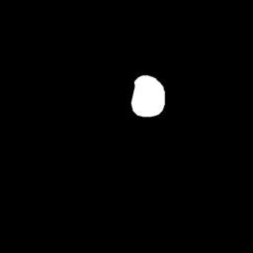</td>
<td>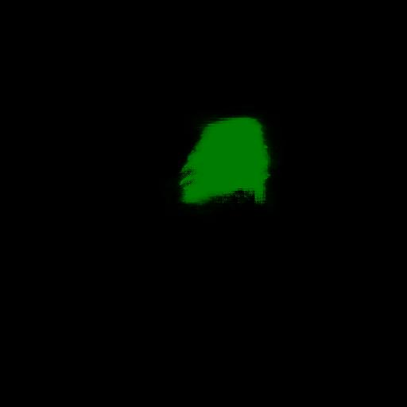</td>
</tr>

<tr>
<td>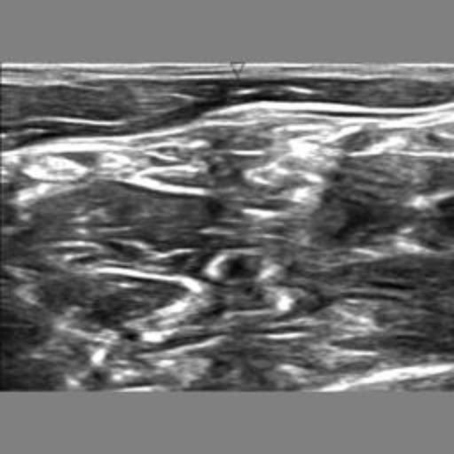</td>
<td>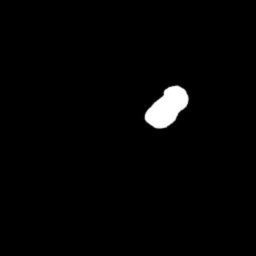</td>
<td>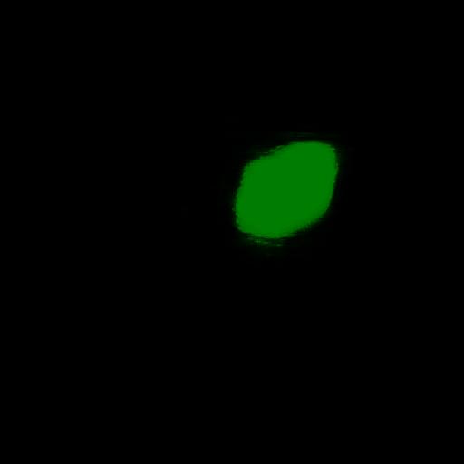</td>
</tr>
<tr>
<td>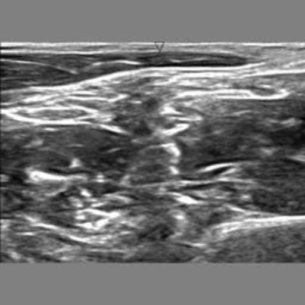</td>
<td></td>
<td>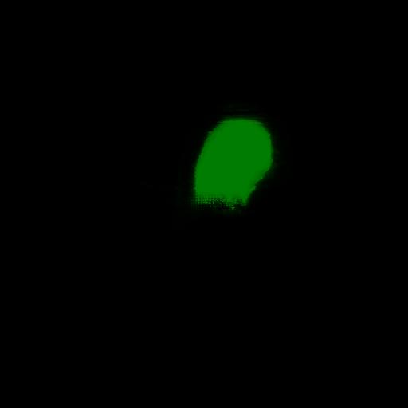</td>
</tr>
<tr>
<td>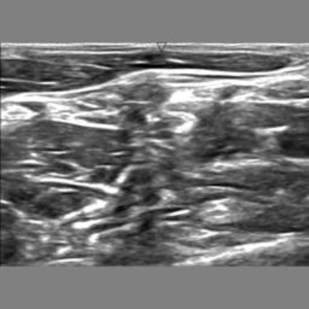</td>
<td>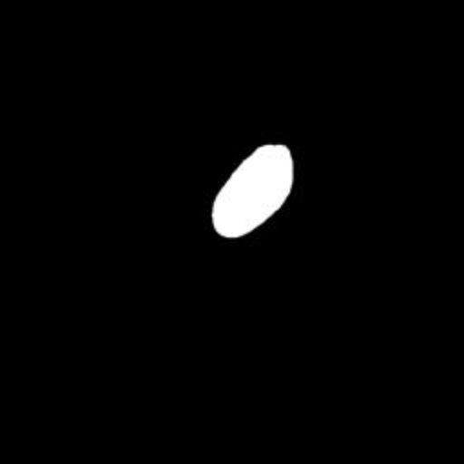</td>
<td></td>
</tr>
<tr>
<td>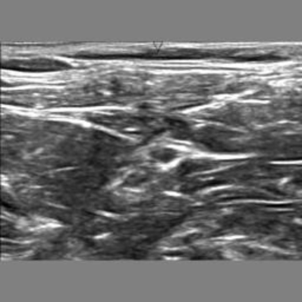</td>
<td>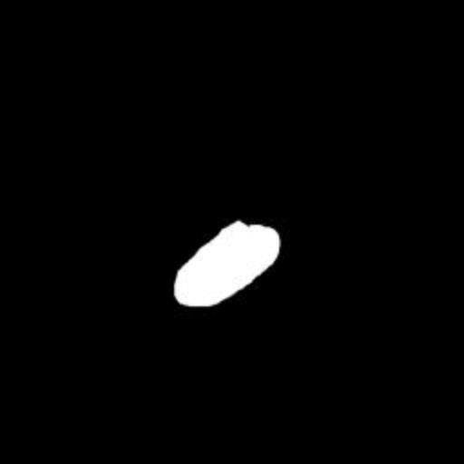</td>
<td>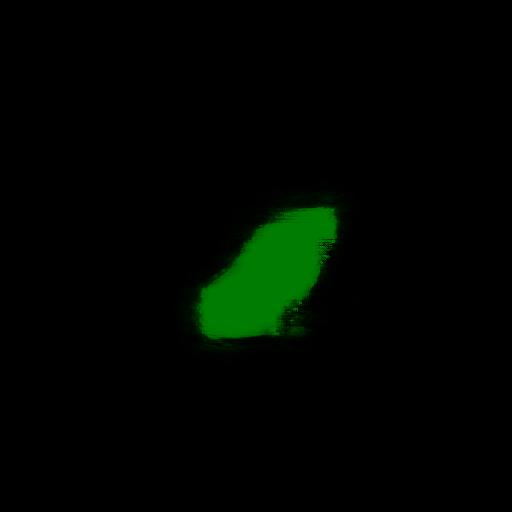</td>
</tr>
</table>

 

<h3>
References
</h3>
<b>1. Ultrasound-Nerve-Segmentation </b> 
<a href="https://github.com/ajayKumar99/Ultrasound-Nerve-Segmentation">https://github.com/ajayKumar99/Ultrasound-Nerve-Segmentation</a>
 
 

<b>2.Real-Time Automated Segmentation of Median Nerve in Dynamic Ultrasonography Using Deep Learning</b> 

Cheng-Liang Yeh, Chueh-Hung Wu, Ming-Yen Hsiao, Po-Ling Kuo  
<a href="https://www.sciencedirect.com/science/article/pii/S0301562922006792">
https://www.sciencedirect.com/science/article/pii/S0301562922006792</a>
 
<a href="https://doi.org/10.1016/j.ultrasmedbio.2022.12.014">https://doi.org/10.1016/j.ultrasmedbio.2022.12.014</a> 

